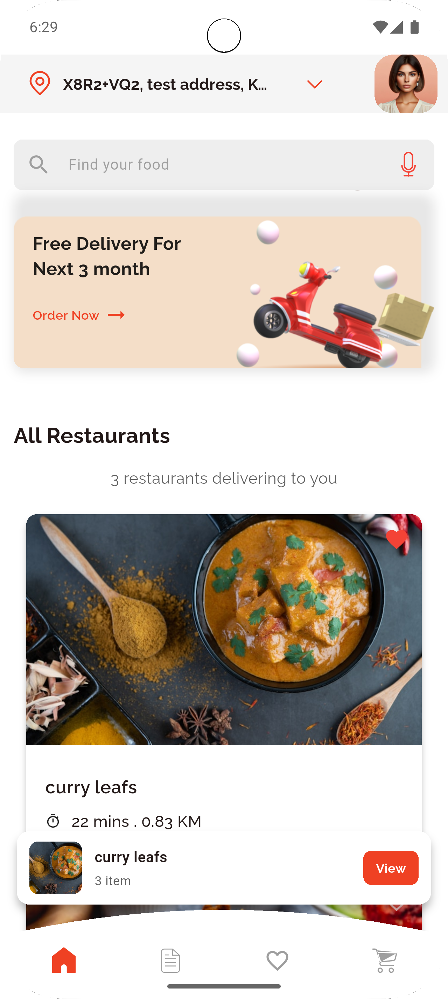
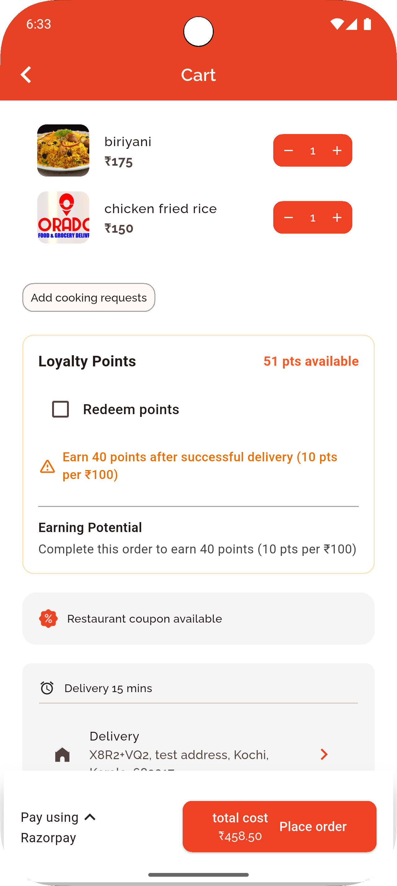
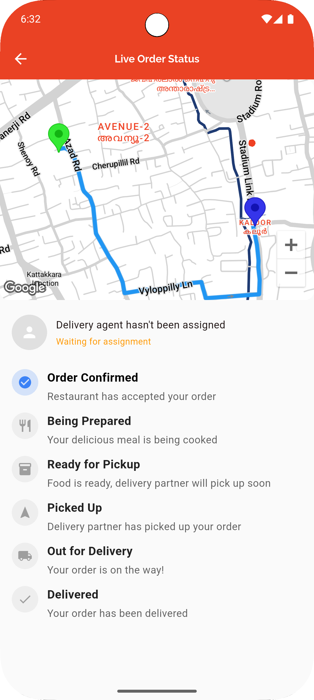
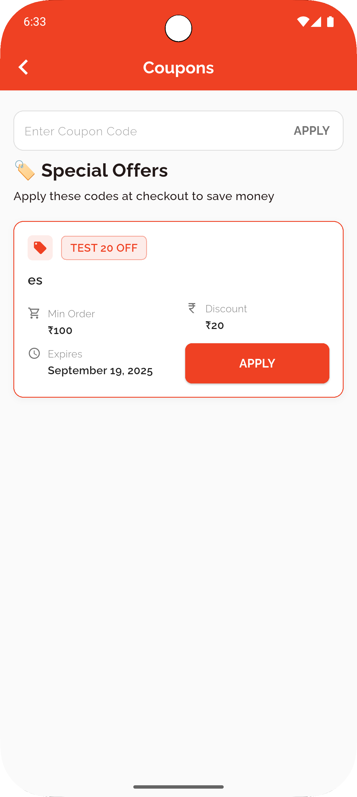
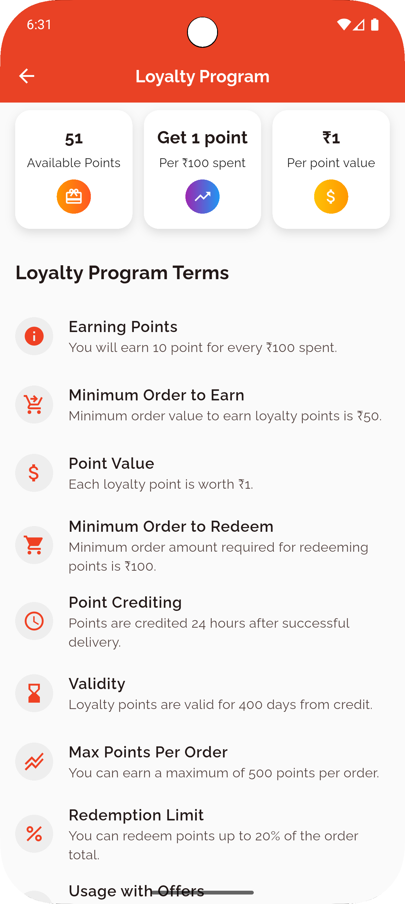
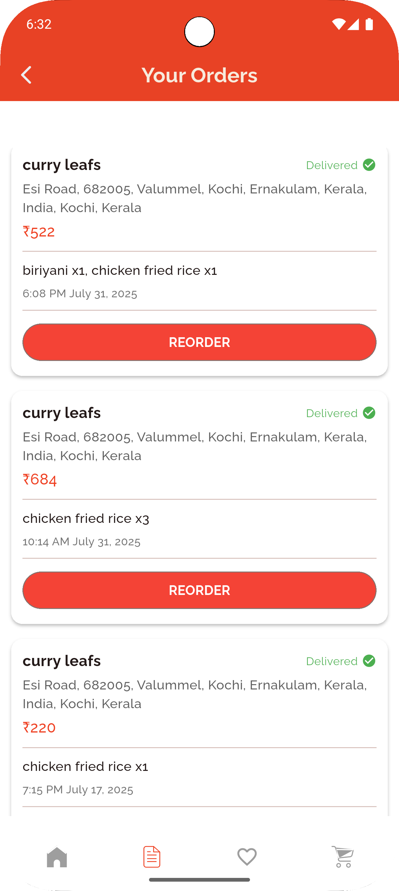

# Orado – Food Delivery Application 🍔🚴‍♂️

Orado is a full-featured **food delivery application** built with **Flutter** and powered by a **Node.js** backend.  
It connects restaurants with customers, offering a seamless ordering experience with **live tracking, coupon discounts, loyalty points,** and **multiple payment options**.

---

## 🚀 Features

- **State Management**: Implemented with `Provider`
- **Navigation**: `GoRouter`
- **Backend**: Node.js with real-time updates via `Socket.io`
- **Authentication**: OTP & email/password with Firebase Cloud Messaging notifications
- **Maps Integration**: Google Maps for precise location and live tracking
- **Coupon System**: Discount codes at checkout
- **Loyalty Points System**: Earn points per order for future discounts
- **Multiple Payment Options**: Razorpay integration & Cash on Delivery support
- **Additional Features**:
    - Favourites section
    - Past orders
    - Complaint ticket system
- **Performance Optimized**: Smooth navigation, fast load times, and reliability

---

## 📸 Screenshots

| Home Screen | Cart Screen | Live Tracking |
|-------------|-------------|--------------|
|  |  |  |

| Coupons | Loyalty Points | Past Orders |
|---------|---------------|-------------|
|  |  |  |

---

## 🛠 Tech Stack

- **Frontend**: Flutter (Dart)
- **State Management**: Provider
- **Navigation**: GoRouter
- **Backend**: Node.js, Socket.io
- **Database**: MongoDB
- **Cloud Services**: Firebase Cloud Messaging (FCM)
- **Payments**: Razorpay
- **Maps**: Google Maps API

---

## 📂 Folder Structure

